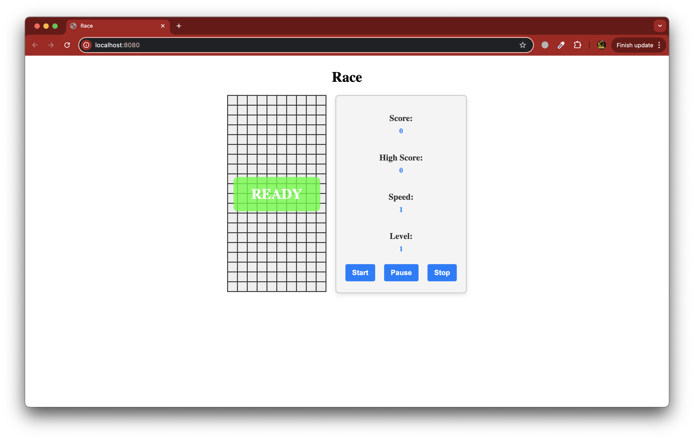
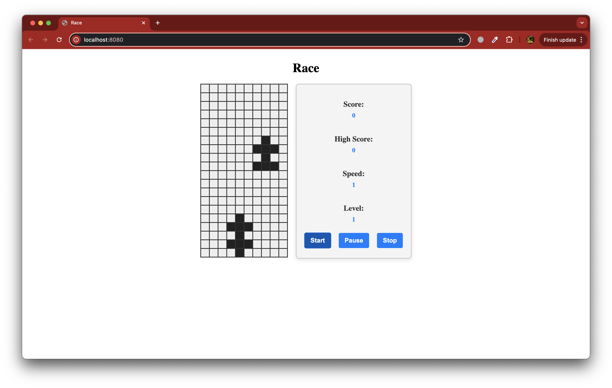
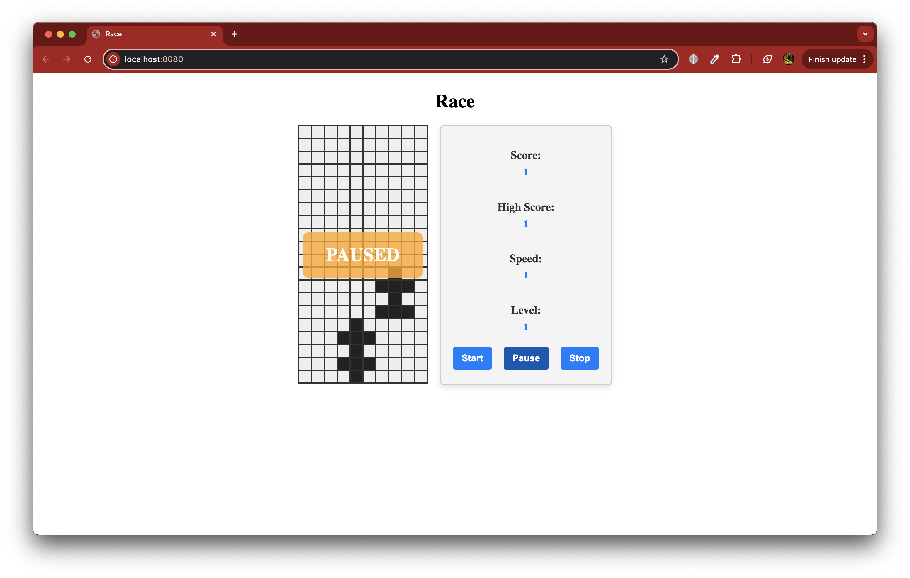
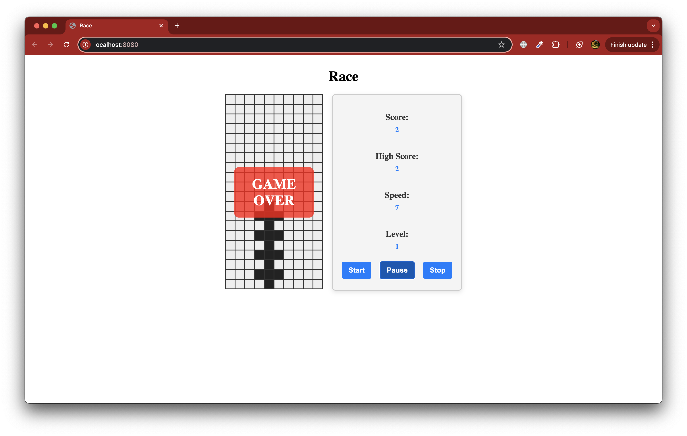

# 🚗 Учебный проект "Гонки" на Kotlin

Данный проект представляет собой учебное клиент-серверное приложение, реализующее игру "Гонки". Оно создано для демонстрации принципов разработки современных приложений на языке Kotlin с использованием передовых технологий, таких как **Ktor** и **конечные автоматы**.

---

## 🔧 Технологический стек

- **Kotlin**: Основной язык разработки, благодаря которому проект получился лаконичным и безопасным.
- **Ktor**: Фреймворк для создания веб-приложений. Используется для реализации REST API и обработки клиентских запросов.
- **Конечный автомат**: Основной механизм управления состояниями игры. Обеспечивает чёткое разграничение логики обработки пользовательских действий.
- **Kotlinx Serialization**: Используется для сериализации и десериализации данных между клиентом и сервером.
- **JetBrains IDEA**: IDE для написания и отладки кода.
- **HTTP REST API**: Реализован интерфейс для управления игровым процессом через сетевые запросы.
- **JSON**: Формат передачи данных между клиентом и сервером.

---

## 📂 Архитектура проекта

Проект разделён на следующие модули:

1. Серверная часть:

- **Реализована на базе Ktor**.
- **Обрабатывает** запросы клиента, такие как управление автомобилем и получение текущего состояния игры.
- **Управляет** игровым процессом с использованием конечного автомата.
- **Включает эндпоинты**:
    - **/api/games** — управление играми.
    - **/api/actions** — обработка действий игрока.
    - **/api/state** — получение текущего состояния игры.

2. Клиентская часть:

- **Реализует** взаимодействие с сервером через REST API.
- **Поддерживает** консольный интерфейс для управления игрой.
- **В** будущем планируется поддержка графического интерфейса.

3. Игровая логика:

- **Управление** состояниями игры (например, старт, пауза, окончание игры).
- **Обработка** событий, таких как движение машины, повышение уровня сложности и расчёт очков.

---

## 🚀 Функциональность

- **Запуск** игры и управление игровым процессом через REST API.
- **Обновление** состояния игры с определённой периодичностью.
- **Обработка** пользовательских действий:
- **Старт**/пауза/окончание игры.
- **Движение** автомобиля (вверх, вниз, влево, вправо).
- **Поддержка** работы с несколькими клиентами.
- **Хранение** и отображение текущего и рекордного счёта.

---

## ⚙️ Установка и запуск

1. **Убедитесь**, что установлен Kotlin и JDK 17+.
2. **Клонируйте** репозиторий:

   ```bash
   git clone https://github.com/dimax77/brick_game.git
3. **Перейдите** в директорию проекта:

   ```bash
   cd race-game
4. **Запустите** сервер:

   ```bash
   ./gradlew runServer
5. **Подключите** клиент, используя REST API.

   ```bash
   localhost:8080

---

📚 **Чему можно научиться, изучая проект?**

- Разработке клиент-серверных приложений с использованием Ktor.
- Управлению состояниями приложения с помощью конечного автомата.
- Использованию REST API для взаимодействия между клиентом и сервером.
- Работе с сериализацией данных с помощью Kotlinx Serialization.
- Архитектурному проектированию приложений.

---

## 📸 Скриншоты

1. 
2. 
3. 
4. 
